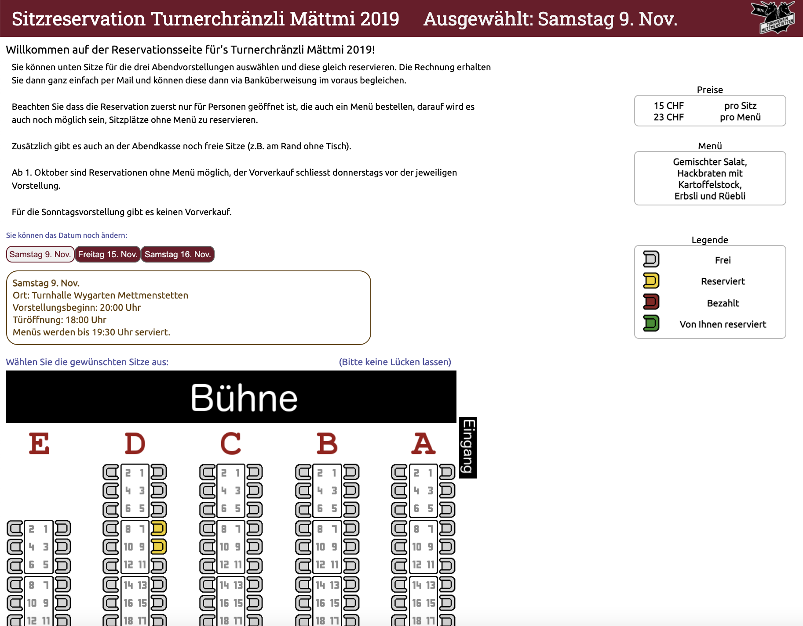
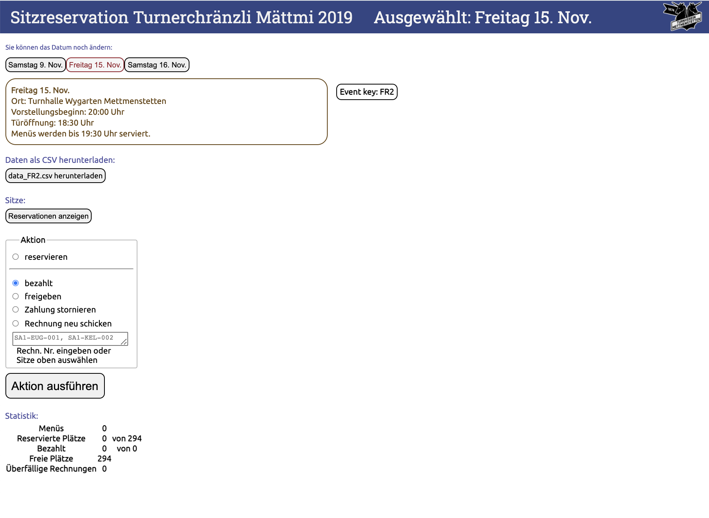

# Sitzreservation

A simple seat reservation tool sending confirmation emails with QR-code tickets. The live version is at [tickets.tvmettmenstetten.ch](https://tickets.tvmettmenstetten.ch). A lot of this has bben hardcoded and wasn't intended to be transferred to a different site, but it shouldn't be hard to modify.

### Contribution
Please feel free to use and modify this code to your liking (That's what the [MIT licence](LICENSE) says). If you have time to make some improvement to the code, contributions are very welcome! 

And if you need help getting stuff running, I'm always happy to do so :)

## Setup
Modifications needed to get this running (Most of them are marked with a `TODO` in the code):

- `.htaccess` and `data/.htaccess`: Set the `AuthUserFile` correctly.
- Everything in `config/text.yml` needs adaptation. In particular the payment infos in the entries `mail_msg_bill` and `mail_msg_bill_reminder`.
- The room layout is hardcoded. To change it you may want to adapt CSS style in `css/room.css`, along with the method `create_room()` in both files `dynamic_parts.py` and `dynamic_parts_op.py`. The config file `config/config.yml` contains two relevant options `tables` and `seats_per_table` that can be helpful and finally the images under `img/` might need adaptation.
- The email credentials are hardcoded in `utils/mail.py`.
- The log-files under `logs/` and the data files under `data/` should be autogenerated if missing, but they might have wrong file permissions. Refer to the file `fix_permissions` for guidance.


### Frontend


That's the `index.cgi`. There are options to allow booking with food earlier than without and to close the option for food earlier. The form validation is done with JS (`js/validateForm.js`) and again in the python script. However, the JS-validation is not very strict (for example "0" is a valid phone number). 

Once a user booked seats they get an email with the confirmation and they can then pay the club using the information in this email.

### Backend


Calling the `optool.cgi` one gets to the admin site with options to cancel bookings, register payment, etc. Hovering over a name next to a booked seat displays the booking information. For changes in personal details it might be easier to change tehm directly in the data file.

**IMPORTANT:** Access to `optool.cgi` and the `data/` folder is done exclusively through `.htaccess` files, and might need adaptation when setting up newly.

## Details

### Python
I set up a [Python venv](https://docs.python.org/3/library/venv.html) on the server. There are Bash exectution instructions on top of the files in the form of `#!../../python_tvm/bin/python` which need adaptation, in particular in `index.cgi` and `optool.cgi`. (Python files end with `.cgi` instead of `.py` because of how our hosted apache server was set up)

The current version is running on Python 3.9.4 although the version shouldn't matter. the installed modules (`pip freeze`) are
```
Pillow==8.3.1
pypng==0.0.21
PyQRCode==1.2.1
PyYAML==5.4.1
```
(I think Pillow is only needed to put the club logo in the middle of the QR-codes, which could be easily removed.)

### Sending emails
In the file `utils/mail.py` the email credentials to send confirmation emails are currently hardcoded. If you use GMAIL you have to "Allow less Secure Apps" in your Google account and it might be worth rewriting this bit using the [GMAIL API](https://developers.google.com/gmail/api/guides/sending).

### QR-Codes
We used an Android app ([also here on Github](https://github.com/joneugster/sitzreservation-QR)) to read the QR-codes although that one isn't very adaptable either... The QR-code just contains some booking information in plain text.

### Permissions
It might be not necessary but at some point I set writing permissions (`chmod a+w`) for certain files. 
